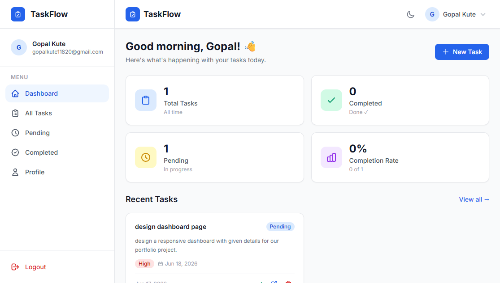
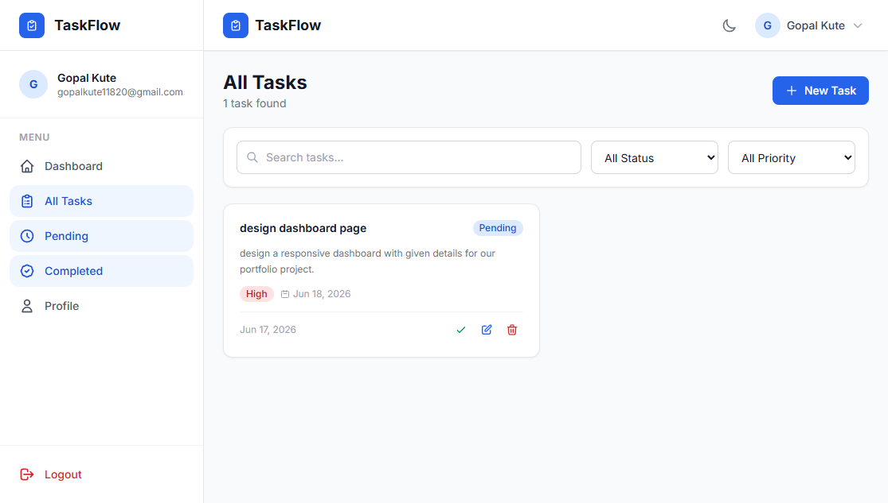
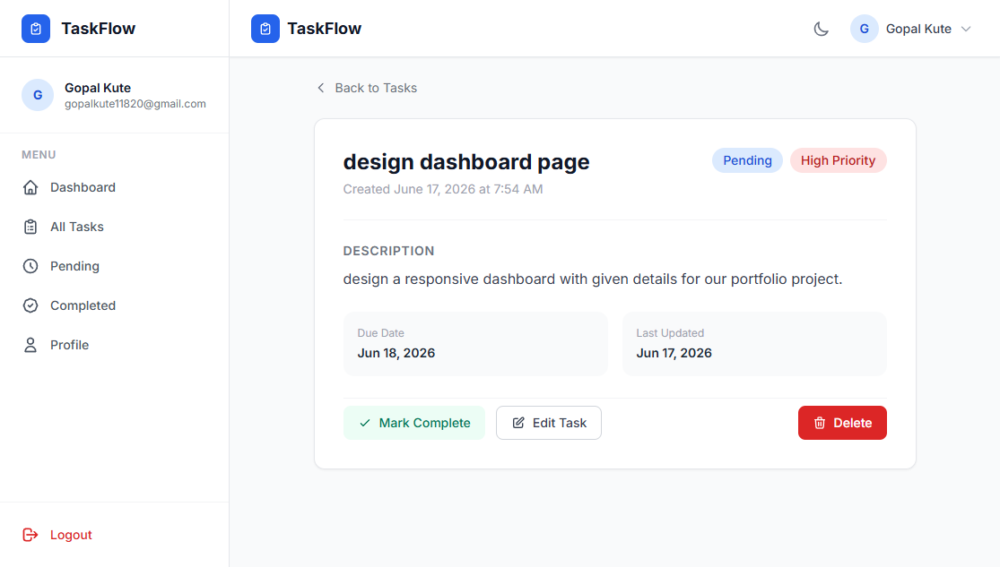
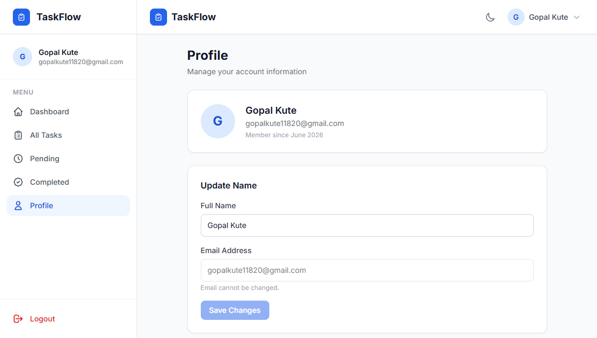

# ✅ TaskFlow — MERN Task Management Application

A complete, production-ready **task management web application** built with the MERN Stack. Features JWT authentication, full CRUD operations, real-time search, filtering, pagination, dark/light mode, Swagger API docs, and Jest test coverage.

---

## 📸 Features

| Feature | Description |
|---|---|
| 🔐 Authentication | Register, Login, Logout with JWT |
| ✅ Task CRUD | Create, Read, Update, Delete tasks |
| 🔄 Status Toggle | Mark tasks as completed or pending |
| 🔍 Search | Real-time debounced search |
| 🎛️ Filter | Filter by status and priority |
| 📄 Pagination | Paginated task list with limit control |
| 👤 Profile | View and update user profile |
| 🌙 Dark Mode | Full light/dark theme, persists in localStorage |
| 📱 Responsive | Mobile, tablet, desktop optimized |
| 📊 Dashboard | Stats — total, completed, pending, completion rate |
| 📚 Swagger Docs | Auto-generated interactive API documentation |
| 🧪 Tests | Jest + Supertest — auth and task API coverage |

---

## 🛠️ Tech Stack

**Frontend:**


**Backend:**


---

## 📁 Folder Structure

```
taskflow/
│
├── package.json                    ← Root scripts (run both servers)
│
├── server/
│   ├── config/
│   │   ├── db.js                   ← MongoDB connection
│   │   └── swagger.js              ← Swagger/OpenAPI config
│   ├── controllers/
│   │   ├── authController.js       ← Register, login, profile logic
│   │   └── taskController.js       ← Task CRUD, stats, toggle logic
│   ├── middleware/
│   │   ├── auth.js                 ← JWT protect middleware
│   │   ├── errorHandler.js         ← Global error handler
│   │   └── validate.js             ← express-validator runner
│   ├── models/
│   │   ├── User.js                 ← name, email, password (hashed)
│   │   └── Task.js                 ← title, status, priority, dueDate, userId
│   ├── routes/
│   │   ├── auth.routes.js          ← /api/auth/*
│   │   └── task.routes.js          ← /api/tasks/*
│   ├── tests/
│   │   ├── auth.test.js            ← Register, login, profile tests
│   │   └── task.test.js            ← CRUD, toggle, search, stats tests
│   ├── utils/
│   │   └── jwt.js                  ← Sign and verify token helpers
│   ├── validators/
│   │   ├── authValidators.js       ← Register and login rules
│   │   └── taskValidators.js       ← Task create and update rules
│   ├── app.js                      ← Express app setup, middleware, routes
│   ├── server.js                   ← Entry point — starts server
│   ├── .env
│   ├── .env.example
│   └── package.json
│
└── client/
    ├── src/
    │   ├── components/
    │   │   ├── auth/               ← ProtectedRoute
    │   │   ├── common/             ← Spinner, Modal, EmptyState, Pagination, Skeleton
    │   │   ├── layout/             ← Navbar, Sidebar, Layout wrapper
    │   │   └── tasks/              ← TaskCard, TaskModal, StatsCards
    │   ├── context/
    │   │   ├── AuthContext.jsx     ← User auth state, JWT storage
    │   │   └── ThemeContext.jsx    ← Dark/light mode toggle + localStorage
    │   ├── hooks/
    │   │   ├── useTasks.js         ← Task fetching, filtering, pagination logic
    │   │   └── useDebounce.js      ← Debounce hook for search input
    │   ├── pages/
    │   │   ├── Login.jsx
    │   │   ├── Register.jsx
    │   │   ├── Dashboard.jsx       ← Stats overview
    │   │   ├── Tasks.jsx           ← Main task list with search + filter
    │   │   ├── TaskDetail.jsx      ← Single task view
    │   │   ├── Profile.jsx         ← View and update user profile
    │   │   └── NotFound.jsx
    │   ├── services/
    │   │   ├── api.js              ← Axios instance with JWT interceptor
    │   │   └── taskService.js      ← Task API calls
    │   ├── utils/
    │   │   └── helpers.js          ← Date formatting, priority colors etc.
    │   ├── App.jsx
    │   ├── main.jsx
    │   └── index.css
    ├── index.html
    ├── vite.config.js
    ├── tailwind.config.js
    └── package.json
```

---

## 🚀 Quick Start

### Prerequisites
- Node.js v18+ ([download](https://nodejs.org))
- MongoDB v6+ running locally **or** a [MongoDB Atlas](https://www.mongodb.com/atlas) URI
- npm v9+

---

### Step 1 — Clone / Extract

```bash
git clone https://github.com/gopalkute02/taskflow.git
cd taskflow
```

---

### Step 2 — Configure Environment

**Backend** — create `server/.env`:

```env
PORT=5000
NODE_ENV=development
MONGO_URI=mongodb://127.0.0.1:27017/taskflow
JWT_SECRET=change_this_to_a_long_random_string
JWT_EXPIRE=7d
CLIENT_URL=http://localhost:5173
```

**Frontend** — create `client/.env`:

```env
VITE_API_URL=http://localhost:5000/api
```

> ⚠️ Change `JWT_SECRET` to a long random string before deploying.

---

### Step 3 — Install Dependencies

```bash
# Install root tools
npm install

# Install all dependencies (server + client)
npm run install:all
```

---

### Step 4 — Run the Application

```bash
# Start both backend and frontend together
npm run dev
```

This runs:
- **Backend** → `http://localhost:5000`
- **Frontend** → `http://localhost:5173`
- **API Docs** → `http://localhost:5000/api/docs`

---

## 📋 API Reference

### Auth Endpoints

| Method | Endpoint | Access | Description |
|--------|----------|--------|-------------|
| `POST` | `/api/auth/register` | Public | Register new user |
| `POST` | `/api/auth/login` | Public | Login — returns JWT |
| `GET` | `/api/auth/profile` | Private 🔒 | Get current user |
| `PUT` | `/api/auth/profile` | Private 🔒 | Update name |

### Task Endpoints

| Method | Endpoint | Access | Description |
|--------|----------|--------|-------------|
| `GET` | `/api/tasks` | Private 🔒 | List tasks (search, filter, paginate) |
| `GET` | `/api/tasks/stats` | Private 🔒 | Dashboard statistics |
| `GET` | `/api/tasks/:id` | Private 🔒 | Get single task |
| `POST` | `/api/tasks` | Private 🔒 | Create task |
| `PUT` | `/api/tasks/:id` | Private 🔒 | Update task |
| `DELETE` | `/api/tasks/:id` | Private 🔒 | Delete task |
| `PATCH` | `/api/tasks/:id/status` | Private 🔒 | Toggle completed / pending |

### Query Parameters — `GET /api/tasks`

```
?status=pending|completed
?priority=low|medium|high
?search=keyword
?page=1
?limit=10
?sortBy=createdAt
?order=asc|desc
```

### Authentication Header

All private routes require:
```
Authorization: Bearer <your_jwt_token>
```

---

## 🗄️ Database Schema

### User Collection

```js
{
  name:      String,    // required, 2–50 chars
  email:     String,    // required, unique, lowercase
  password:  String,    // bcrypt hashed, select: false
  createdAt: Date,      // auto
  updatedAt: Date       // auto
}
```

### Task Collection

```js
{
  title:       String,                      // required, 2–100 chars
  description: String,                      // optional, max 500 chars
  status:      "pending" | "completed",     // default: "pending"
  priority:    "low" | "medium" | "high",   // default: "medium"
  dueDate:     Date,                        // optional
  userId:      ObjectId,                    // ref: User, required
  createdAt:   Date,                        // auto
  updatedAt:   Date                         // auto
}
```

---

## 🧪 Running Tests

Make sure MongoDB is running, then:

```bash
# Run all tests from root
npm run test

# Or run from server directory
cd server && npm test
```

### Test Coverage

- ✅ User registration — success, duplicate email, invalid input
- ✅ User login — success, wrong password, user not found
- ✅ Profile retrieval — authenticated, no token, invalid token
- ✅ Task CRUD — create, read, update, delete
- ✅ Status toggle — pending ↔ completed
- ✅ Search and filter — keyword, status, priority
- ✅ Dashboard stats — totals and completion rate

---

## 📚 Swagger API Documentation

After starting the server, open:

```
http://localhost:5000/api/docs
```

The Swagger UI provides interactive documentation for all endpoints. Click **Authorize**, enter your JWT token to test all protected routes directly in the browser.

---

## 🖼️ Screenshots

| Dashboard — Stats | Tasks — List View |
|---|---|
|  |  |

| Task — Detail Modal | Profile Page |
|---|---|
|  |  |

---

## 🌐 Live Demo

> 🔗 **[CLICK ME - Live taskflow](https://taskflow-gopalkute.vercel.app)**

---

## 🚢 Deployment

### Backend — Render / Railway

1. Push `server/` to a GitHub repository
2. Create a new **Web Service** on [Render](https://render.com)
3. Set root directory to `server/`
4. Build command: `npm install`
5. Start command: `node server.js`
6. Add all environment variables from `server/.env`
7. Set `NODE_ENV=production`

### Frontend — Vercel / Netlify

1. Push `client/` to a GitHub repository
2. Import project on [Vercel](https://vercel.com)
3. Set root directory to `client/`
4. Build command: `npm run build`
5. Output directory: `dist`
6. Add environment variable: `VITE_API_URL=https://your-backend-url.com/api`

### Database — MongoDB Atlas

1. Create a free cluster at [mongodb.com/atlas](https://www.mongodb.com/atlas)
2. Whitelist your server IP (or `0.0.0.0/0` for development)
3. Copy the connection string into `MONGO_URI`

---

## 🔒 Security Features

- **Helmet** — sets secure HTTP headers on every response
- **CORS** — restricted to frontend origin via `CLIENT_URL`
- **Rate Limiting** — 100 requests per 15 minutes per IP
- **JWT** — stateless authentication, 7-day expiry
- **bcrypt** — 12-round password hashing
- **express-validator** — input validation on all endpoints
- **Password hidden** — `select: false` in User schema, never returned in responses

---

## 📝 Environment Variables Reference

### server/.env

```env
PORT=5000
NODE_ENV=development
MONGO_URI=mongodb://127.0.0.1:27017/taskflow
JWT_SECRET=your_super_long_secret_key_here
JWT_EXPIRE=7d
CLIENT_URL=http://localhost:5173
```

### client/.env

```env
VITE_API_URL=http://localhost:5000/api
```

---

## 👨‍💻 Author

**Gopal Kute**
Final Year B.Tech Computer Engineering · MERN Stack Developer

[](https://linkedin.com/in/gopalkute)
[](https://github.com/gopalkute)
[](https://leetcode.com/gopalkute)

---

## 📄 License

MIT — free to use for personal and commercial projects.

---

Built with ❤️ using the MERN Stack
